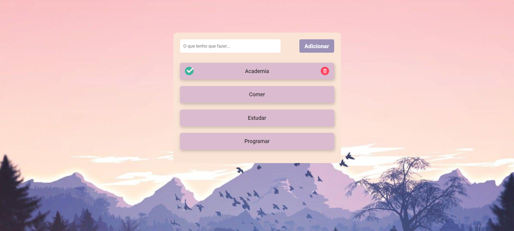

# To do List
 Introdução ao Projeto To-Do List 📝
Este projeto é uma implementação simples de uma To-Do List utilizando HTML, CSS e JavaScript. A aplicação permite que os usuários adicionem, marquem como concluídas e removam tarefas, proporcionando uma forma eficiente de gerenciar tarefas diárias.

A motivação por trás deste projeto foi criar uma ferramenta prática e intuitiva que pudesse ser usada para organizar tarefas pessoais ou profissionais. Além disso, o projeto serviu como uma excelente oportunidade para reforçar conceitos fundamentais de desenvolvimento web, como manipulação do DOM, eventos em JavaScript, e armazenamento local com localStorage.

